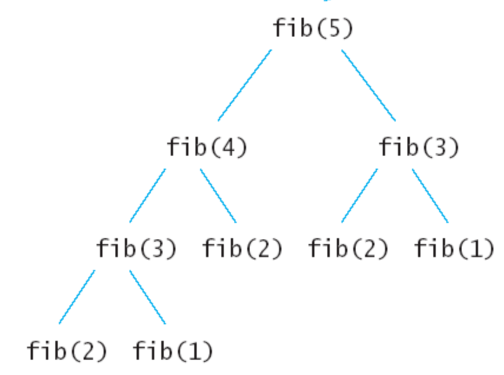

# 动态规划

动态规划（Dynamic programming，简称 DP）是一种在数学、管理科学、计算机科学、经济学和生物信息学中使用的，通过把原问题分解为相对简单的子问题的方式求解复杂问题的方法。

动态规划常常适用于有重叠子问题和最优子结构性质的问题，动态规划方法所耗时间往往远少于朴素解法。

动态规划背后的基本思想非常简单。大致上，若要解一个给定问题，我们需要解其不同部分（即子问题），再根据子问题的解以得出原问题的解。

通常许多子问题非常相似，为此动态规划法试图仅仅解决每个子问题一次，从而减少计算量：一旦某个给定子问题的解已经算出，则将其记忆化存储，以便下次需要同一个子问题解之时直接查表。这种做法在重复子问题的数目关于输入的规模呈指数增长时特别有用。

## 1.下面让我们从一个硬币找零问题谈起

假设我们有 1、5、10、20、50、100 元面值的钞票。现在您的目标是凑出某个金额 w，需要用到尽量少的钞票。
依照生活的经验我们显然可以采取这样的策略：能用 100 的就尽量用 100 的，否则尽量用 50 的……依次类推。在这种策略下，666=6×100+1×50+1×10+1×5+1×1，共使用了 10 张钞票。

这种策略称为“贪心”：假设我们面对的局面是“需要凑出 w”，贪心策略会尽快让 w 变得更小。能让 w 少 100 就尽量让它少 100，这样我们接下来面对的局面就是凑出 w-100。长期的生活经验表明，贪心策略是正确的。

但是，如果我们换一组钞票的面值，贪心策略就也许不成立了。如果一个奇葩国家的钞票面额分别是 1、5、11，那么我们在凑出 15 的时候，贪心策略会出错：

- 15=1×11+4×1 （贪心策略使用了 5 张钞票）
- 15=3×5 （正确的策略，只用 3 张钞票）
- 为什么会这样呢？贪心策略错在了哪里？

刚刚已经说过，贪心策略的纲领是：“尽量使接下来面对的 w 更小”。这样，贪心策略在 w=15 的局面时，会优先使用 11 来把 w 降到 4；但是在这个问题中，凑出 4 的代价是很高的，必须使用 4×1。如果使用了 5，w 会降为 10，虽然没有 4 那么小，但是凑出 10 只需要两张 5 元。
在这里我们发现，贪心是一种只考虑眼前情况的策略。

那么，现在我们怎样才能避免鼠目寸光呢？

如果直接暴力枚举凑出 w 的方案，明显复杂度过高。太多种方法可以凑出 w 了，枚举它们的时间是不可承受的。我们现在来尝试找一下性质。

重新分析刚刚的例子。w=15 时，我们如果取 11，接下来就面对 w=4 的情况；如果取 5，则接下来面对 w=10 的情况。我们发现这些问题都有相同的形式：“给定 w，凑出 w 所用的最少钞票是多少张？”接下来，我们用 f(n)来表示“凑出 n 所需的最少钞票数量”。

那么，如果我们取了 11，最后的代价（用掉的钞票总数）是多少呢？

明显 cost = f(4) + 1 = 4 + 1 ，它的意义是：利用 11 来凑出 15，付出的代价等于 f(4)加上自己这一张钞票。现在我们暂时不管 f(4)怎么求出来。

依次类推，马上可以知道：如果我们用 5 来凑出 15，cost 就是 f(10) + 1 = 2 + 1 = 3。

那么，现在 w=15 的时候，我们该取那种钞票呢？当然是各种方案中，cost 值最低的那一个！

- 取 11：cost = f(4) + 1 = 4 + 1 = 5
- 取 5: cost = f(10) + 1 = 2 + 1 = 3
- 取 1: cost = f(14) + 1 = 4 + 1 = 5

显而易见，cost 值最低的是取 5 的方案。我们通过上面三个式子，做出了正确的决策！

这给了我们一个至关重要的启示—— f(n) 只与 f(n - 1)，f(n - 5)，f(n - 11) 相关；更确切地说：

f(n) = min{f(n - 1), f(n - 5), f(n - 11)}

下面让我们用代码表示求得 f(n)的过程：

```js
function minCoinChange(n) {
  // dp[n] 凑出 n 所需的最少钞票数量
  const dp = Array(n + 1).fill(Infinity)
  dp[0] = 0
  for (let i = 1; i <= n; i++) {
    if (i - 1 >= 0) {
      dp[i] = Math.min(dp[i], dp[i - 1] + 1)
    }
    if (i - 5 >= 0) {
      dp[i] = Math.min(dp[i], dp[i - 5] + 1)
    }
    if (i - 11 >= 0) {
      dp[i] = Math.min(dp[i], dp[i - 11] + 1)
    }
  }
  return dp[n]
}

const count = minCoinChange(15) // count = 3
```

我们以 O(n) 的复杂度解决了这个问题。现在回过头来，我们看看它的原理：

- f(n) 只与 f(n - 1)，f(n - 5)，f(n - 11) 相关
- 我们只关心 f(n) 的值，不关心是怎么凑出 n 的。

这两个事实，保证了我们做法的正确性。它比起贪心策略，会分别算出取 1、5、11 的代价，从而做出一个正确决策，这样就避免掉了“鼠目寸光”！

它与暴力的区别在哪里？我们的暴力枚举了“使用的硬币”，然而这属于冗余信息。我们要的是答案，根本不关心这个答案是怎么凑出来的。
譬如，要求出 f(15)，只需要知道 f(14),f(10),f(4)的值。其他信息并不需要。我们舍弃了冗余信息。我们只记录了对解决问题有帮助的信息——f(n).

我们能这样干，取决于问题的性质：求出 f(n)，只需要知道几个更小的 f(c)。我们将求解 f(c) 称作求解 f(n)的“子问题”。

## 2. 几个简单的概念

- 无后效性：即子问题的解一旦确定，就不再改变，不受在这之后、包含它的更大的问题的求解决策影响。
  从之前的代码可以看出一旦 f(n)确定，“我们如何凑出 f(n)”就再也用不着了。
  要求出 f(15)，只需要知道 f(14),f(10),f(4)的值，而 f(14),f(10),f(4) 是如何算出来的，对之后的问题没有影响。
  “未来与过去无关”，这就是无后效性。

- 最优子结构性质：如果问题的最优解所包含的子问题的解也是最优的，我们就称该问题具有最优子结构性质（即满足最优化原理）。
  回顾我们对 f(n)的定义：我们记“凑出 n 所需的最少钞票数量”为 f(n).
  f(n)的定义就已经蕴含了“最优”。利用 w=14,10,4 的最优解，我们即可算出 w=15 的最优解。
  大问题的最优解可以由小问题的最优解推出，这个性质叫做“最优子结构性质”。

- 子问题重叠性质：子问题重叠性质是指在用递归算法自顶向下对问题进行求解时，每次产生的子问题并不总是新问题，有些子问题会被重复计算多次。动态規劃算法正是利用了这种子问题的重叠性质，对每一个子问题只计算一次，然后将其计算结果保存在一个表格中，当再次需要计算已经计算过的子问题时，只是在表格中简单地查看一下结果，从而获得较高的效率，降低了时间复杂度。

现在让我们看一个具有子问题重叠性质的问题： 求斐波拉契数列 Fibonacci

递归写法

```js
function fib(n) {
  if (n === 0) return 0
  if (n === 1) return 1
  return fib(n - 1) + fib(n - 2)
}
```

可分析下该算法的执行流程，假如输入 5，那么执行的递归树如下：

可以看到递归树中的每个子节点都会执行一次，很多重复的节点被执行。

动态规划写法

```js
function fib(n) {
  const dp = Array(n + 1)
  dp[0] = 0
  dp[1] = 1
  for (let i = 2; i <= n; i++) {
    dp[i] = dp[i - 1] + dp[i - 2]
  }
}
```

可以看出重复的字问题只被计算了一次，我们在 O(n)的时间内完成了计算

## DP 的核心思想

### DP 为什么会快

无论是 DP 还是暴力，我们的算法都是在可能解空间内，寻找最优解。

来看钞票问题。暴力做法是枚举所有的可能解，这是最大的可能解空间。DP 是枚举有希望成为答案的解。这个空间比暴力的小得多。

也就是说：DP 自带剪枝。

DP 舍弃了一大堆不可能成为最优解的答案。譬如：
15 = 5+5+5 被考虑了。
15 = 5+5+1+1+1+1+1 从来没有考虑过，因为这不可能成为最优解。

从而我们可以得到 DP 的核心思想：尽量缩小可能解空间。

在暴力算法中，可能解空间往往是指数级的大小；如果我们采用 DP，那么有可能把解空间的大小降到多项式级。

一般来说，解空间越小，寻找解就越快。这样就完成了优化。

### DP 的操作过程

一言以蔽之：大事化小，小事化了。

将一个大问题转化成几个子问题；

- 定义子问题
- 求解子问题；
- 推出大问题问题的解

需要注意得是动态规划和分治法都是将复杂问题分解成更新的子问题来解决问题的技术。但是分治法是把问题分解成相互独立的子问题，然后组合他们的答案，而动态规划则是将问题分解成相互依赖的子问题。

### 如何设计 DP 算法

设计 DP 算法，往往可以遵循 DP 三连：

- 我是谁？（定义状态，表示局面）
- 我从哪里来？
- 我要到哪里去？（设计转移）

设计状态是 DP 的基础。接下来的设计转移，有两种方式：一种是考虑我从哪里来（之前提到的两个例子，都是在考虑“我从哪里来”）；另一种是考虑我到哪里去，这常见于求出 f(x)之后，更新能从 x 走到的一些解。总而言之，“我从哪里来”和“我要到哪里去”只需要考虑清楚其中一个，就能设计出状态转移方程。

## 例题

### 最长上升子序列

给定一个无序的整数数组，找到其中最长上升子序列的长度。

示例：

- 输入: [10,9,2,5,3,7,101,18]
- 输出: 4
- 解释: 最长的上升子序列是 [2,3,7,101]，它的长度是 4。

如何设计状态（我是谁）？

我们假设 f(x) 是以 arr[x]结尾的最长上升子序列的长度，那么最大的答案显然是 max{f(x)}

状态 x 是从哪里推过来的（我从哪里来）？

考虑比 x 小的每一个索引：如果 arr[x] > arr[index]，
那么 f(x)可以取 f(index) + 1

那么 f(x) = max{f(index)} + 1, 其中 index < x，
并且 arr[index] < arr[x]

```js
var lengthOfLIS = function (nums) {
  const len = nums.length
  if (len === 0) return 0
  // 表示以n 结尾的最长上升子序列长度
  const dp = Array(len).fill(1)
  for (let i = 0; i < len; i++) {
    for (let j = 0; j < i; j++) {
      if (nums[j] < nums[i]) {
        dp[i] = Math.max(dp[i], dp[j] + 1)
      }
    }
  }

  return Math.max(...dp)
}

lengthOfLIS([10, 9, 2, 5, 3, 7, 101, 18]) // 4
```

### 编辑距离

给你两个单词 word1 和 word2，请你计算出将 word1 转换成 word2 所使用的最少操作数 。

你可以对一个单词进行如下三种操作：

- 插入一个字符
- 删除一个字符
- 替换一个字符

示例 1：

- 输入：word1 = "horse", word2 = "ros"
- 输出：3
- 解释：
  horse -> rorse (将 'h' 替换为 'r')
  rorse -> rose (删除 'r')
  rose -> ros (删除 'e')

如何设计状态（我是谁）？

我们假设 dp[i][j] 是以 word1 当前第 i 位的单词 与 word2 当前第 i 位的单词 的最短编辑距离

状态 dp[i][j] 是从哪里推过来的（我从哪里来）？

考虑索引 i 和 索引 j，如果当前索引 i 所对应的字符 word1[i]等于 word2[j]，dp[i][j] 可以取 dp[i - 1][j - 1]既不插入，也不删除和替换字符

如果 word1[i]不等于等于 word2[j]，那么我们可以假设

- 1.word1 从 0 到 i - 1 位置与 word2 从 0 到 j - 1 位置的字符已经相同，那么我们只需替换当前不匹配的字符就可以
  得到 dp[i][j] = dp[i - 1][j - 1] + 1
- 2.word1 从 0 到 i - 1 位置与 word2 从 0 到 j 位置的字符已经相同，那么我们只需删除多出的 word1 的字符即当前字符 word1[i]
  可以得到 dp[i][j] = dp[i - 1][j] + 1
- 3.word1 从 0 到 i 位置与 word2 从 0 到 j - 1 位置的字符已经相同，那么我们只需向 word1 中插入字符 word2[j]
  可以得到 dp[i][j] = dp[i][j - 1] + 1

综上所述我们可以得到状态转移方程：

```js
if (word1[i] === word2[j]) {
  dp[i][j] = dp[i - 1][j - 1]
} else {
  dp[i][j] = Math.min(dp[i - 1][j], dp[i][j - 1], dp[i - 1][j - 1]) + 1
}
```

```js
var minDistance = function (word1, word2) {
  const m = word1.length
  const n = word2.length
  const dp = Array(m + 1)
    .fill(0)
    .map(() => Array(n + 1).fill(0))
  for (let i = 0; i <= m; i++) {
    dp[i][0] = i
  }
  for (let i = 0; i <= n; i++) {
    dp[0][i] = i
  }
  for (let i = 1; i <= m; i++) {
    for (let j = 1; j <= n; j++) {
      if (word1[i - 1] === word2[j - 1]) {
        dp[i][j] = dp[i - 1][j - 1]
      } else {
        dp[i][j] = Math.min(dp[i - 1][j], dp[i][j - 1], dp[i - 1][j - 1]) + 1
      }
    }
  }
  return dp[m][n]
}

minDistance('horse', 'ros') // 3
```
